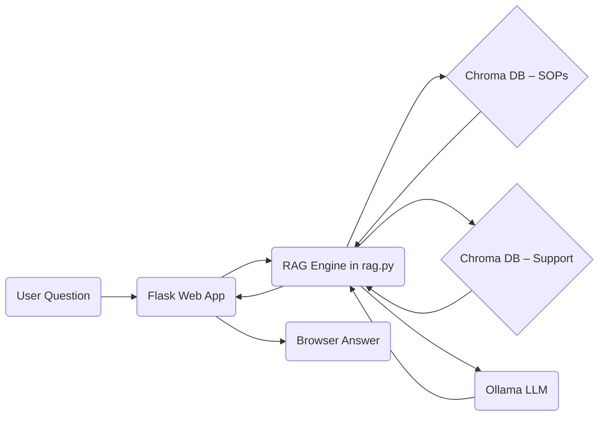

# AI-Enhanced Search – SOP & Support Knowledge Assistant


Welcome!  This project turns an ordinary folder of **Standard Operating Procedures (SOPs)** and **Support Articles** into an intelligent, chat-like search assistant.  Under the hood it uses Retrieval-Augmented Generation (RAG) with two Chroma vector databases and a local Large Language Model (LLM) served by **Ollama**.


---

## 1&nbsp;·&nbsp;Why does this app exist?
Dental offices accumulate dozens of SOP documents and support articles scattered across shared drives.  Finding the right paragraph quickly is frustrating.  This assistant lets you *ask a question in plain English* (e.g. "How do I process refunds?") and get a Markdown answer with the exact document excerpts that back it up.

High-level flow:



---

## 2&nbsp;·&nbsp;Quick-Start (TL;DR)
Paste the following in PowerShell **from the project folder** (`ai-enhanced-search`) – each block is one command:

```powershell
# 1. Create Python virtual environment
python -m venv .venv
.venv\Scripts\Activate.ps1

# 2. Install dependencies
pip install -r requirements.txt

# 3. Download the LLM (≈ 4 GB)
ollama pull qwen3:latest

# 4. Build or refresh the SOP database (optional first run may take minutes)
python index_sop.py

# 5. Launch the web app
python app.py
```

Open your browser at **http://localhost:5000** and start asking questions!

> **Tip**: The first query is slower because embeddings are generated; subsequent searches are fast.

---

## 3&nbsp;·&nbsp;Prerequisites
1. **Windows 10/11** (macOS & Linux work too – commands are analogous).
2. **Python 3.10+** – Download from <https://www.python.org/downloads> and *check the "Add Python to PATH" box* during install.
3. **Git** – optional but handy (<https://git-scm.com/download/win>).
4. **Ollama** – local LLM server.  Get the Windows installer from <https://ollama.ai/download>.  After install, Ollama runs in the background on port 11434.
5. *(Optional)* **ocrmypdf** – only needed if you have image-only PDFs.  Install via:
   ```powershell
   choco install ocrmypdf    # <- requires Chocolatey
   ```

---

## 4&nbsp;·&nbsp;Configuration Reference
All tunable settings live in **`rag.py`** and **`index_sop.py`**.  Most people can skip this, but if you need to customise paths or models, edit the constants near the top of each file.

| Setting | File | Purpose | Default |
|---------|------|---------|---------|
| `OLLAMA_MODEL` | `rag.py` | Which LLM Ollama serves | `qwen3:latest` |
| `N_CHUNKS` | `rag.py` | # of document chunks retrieved | `4` |
| `CHUNK_SIZE` | `index_sop.py` | Words per chunk when splitting docs | `300` |
| `SOURCE_DIR` | `index_sop.py` | Folder containing your raw SOP files | `sop_documents` |
| `CHROMA_PATH` | both | Where the vector DB is stored on disk | `./chroma_sops` + `./chromadb_data` |

You can also set any of these as **environment variables** before running the app, e.g.:
```powershell
$Env:OLLAMA_MODEL = "mistral:7b"
$Env:SOURCE_DIR = "C:\path\to\your\documents"
python app.py
```

---

## 5&nbsp;·&nbsp;Indexing / Data-Ingestion Workflow
1. Place your SOP PDFs, DOCX, or TXT files in the folder defined by `SOURCE_DIR` (defaults to `sop_documents/` in the project root).
2. *(Optional)* Add front-matter metadata inside the document or maintain a CSV named `SOP_metadata.csv` – the script will merge these.
3. Run `python index_sop.py`.
4. The script extracts text, OCRs if needed, splits into overlapping chunks, embeds them, and stores everything in **Chroma**.
5. You should see a success message like `✓ Indexed 12,345 chunks into 'sop_vectors'.`

Repeat the same for Support Articles or add your own by following the pattern making sure to update the CHROMA_PATH and COLLECTION_NAME variables

---

## 6&nbsp;·&nbsp;Database Schema & Metadata Mapping
Each chunk stored in Chroma contains:

| Canonical Key | Aliases in raw docs | Example |
|---------------|--------------------|---------|
| `title` | `title`, `sop_name`, `name` | "Patient Check-In" |
| `id` | `sop_id`, `guid` | `SOP-123` |
| `department` | `dept`, `team` | "Front Desk" |

The mapping is defined in `DB_CFG` inside `rag.py`.  Add a new key or alias just by editing that dictionary.

---

## 7&nbsp;·&nbsp;API Reference
`POST /search`

Request JSON:
```json
{
  "query"  : "How do I process refunds?",
  "domain" : "sop"      // or "support"
}
```

Successful Response:
```json
{
  "answer" : "Markdown answer …",
  "sources": [
    { "title":"Refund Policy", "relevance":92.3, "preview":"…", "id":"SOP-045", "department":"Finance" }
  ]
}
```

Error Codes:
* **400** – Empty query or unknown domain
* **500** – Server error (see console log)

---

## 8&nbsp;·&nbsp;Using the Web Front-End
1. Choose **Company SOPs** or **Support Articles** from the dropdown.
2. Type your question and press **Enter**.
3. The answer appears in nicely formatted Markdown; supporting source cards show relevance percentages.
4. Click **Ask Another Question** to reset.


---

## 9&nbsp;·&nbsp;Testing
This repo currently has no automated tests.  A simple manual test:
1. Start Ollama (`ollama run qwen3`) and the Flask app (`python app.py`).
2. In a separate terminal run:
   ```powershell
   curl -X POST http://localhost:5000/search -H "Content-Type: application/json" -d '{"query":"What is HIPAA?","domain":"sop"}'
   ```
3. Verify that `answer` is non-empty and `sources` is an array.

> **Developers**: add `pytest` + `chromadb.Client(settings={"is_persistent":False})` for unit tests.

---

## 10&nbsp;·&nbsp;Deployment & Operations
* **Production server** – run via *gunicorn* (Linux) or *waitress* (Windows):
  ```powershell
  pip install waitress
  waitress-serve --call 'app:create_app'
  ```
* Behind a reverse-proxy (Nginx/Apache) forward port 80 → 5000.
* Back up the folders `chroma_sops` and `chromadb_data` regularly – they hold all embeddings.
* Logs: Flask prints to console; redirect to a file using `>> app.log 2>&1` if needed.

---

## 11&nbsp;·&nbsp;Extending the Project
Want to add a **third** knowledge-base?
1. Build a new Chroma collection as shown in `index_sop.py`.
2. Add a new entry in `DB_CFG` (copy-paste and tweak).  Point `persist_dir` and `collection` to your new folder.
3. Add an option in `templates/index.html`'s `<select>` dropdown.
4. Re-start the app – no further code changes!

---

## 12&nbsp;·&nbsp;Security & Privacy
* All data and the LLM run **locally** – nothing is sent to external servers.
* There is **no authentication** baked in; if you expose the app beyond localhost you must add a login layer (Flask-Login, reverse-proxy auth, etc.).
* Files stored:  
  `chroma_*/` (vector DB) • `*.pdf/.docx/.txt` (raw docs) • log files you create.

---

## 13&nbsp;·&nbsp;License
This project is licensed under the MIT License - see the [LICENSE](LICENSE) file for details.

---

## 14&nbsp;·&nbsp;Contributing
1. Fork → create feature branch → commit with clear messages.  
2. Run `black` (`pip install black`) for formatting.  
3. Submit a Pull Request.  
4. The maintainer will review, request changes if necessary, and merge.

---

## 15&nbsp;·&nbsp;Changelog
Create `CHANGELOG.md` using the *Keep a Changelog* format.  Example entry:
```
## [1.1.0] – 2025-03-27
### Added
- Support Article database
- Front-end domain selector
```

---

## 16&nbsp;·&nbsp;Code Documentation
Key functions such as `rag_inference()` and `search_similar_chunks()` contain inline docstrings – open the files and read them in any IDE for deeper understanding.

---

## 17&nbsp;·&nbsp;Glossary
| Term | Meaning |
|------|---------|
| **RAG** | Retrieval-Augmented Generation – combining search results with an LLM answer. |
| **SOP** | Standard Operating Procedure document. |
| **Chroma** | Open-source vector database storing embeddings. |
| **Embedding** | Numeric representation of text that captures semantic meaning. |
| **Ollama** | Local server that runs LLMs on your machine. |

---

## 18&nbsp;·&nbsp;Known Limitations & Roadmap
* Max tokens generated set to 4096 – very long answers may be cut off.  
* Only two knowledge-bases (SOP, Support) are wired in code.  
* No authentication or role-based access control.  
* Indexer scripts for Support Articles are not yet open-sourced.  

**Planned:** add a settings UI, implement user login, and ship Docker images for one-command deployment.
